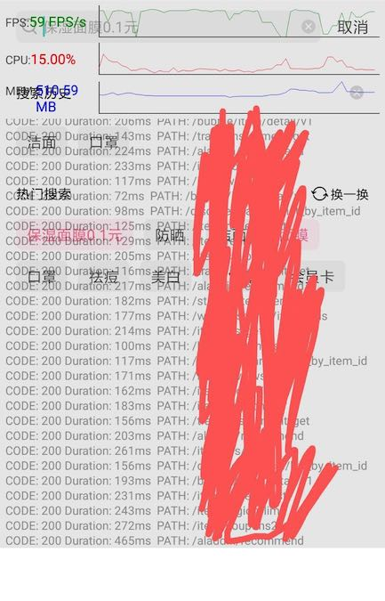

# Magic-Box

MagicBox是一款Android平台的性能检测, 接口请求控制和拦截等工具合集. 建议在Debug和测试阶段使用.

## 功能清单

|性能|描述|
|:-:|:-:|
|CPU|APP的实时CPU使用率|
|内存|APP的实时内存使用量|
|帧率|APP的实时渲染帧率|
|数据可视化|开启系统悬浮窗, 将以上数据可视化|

|网络(支持3.x okhttp)|描述|
|:-:|:-:|
|请求状态模拟|模拟弱网, 超时, 404等接口状态|
|请求日志|拦截请求, 汇总基本属性和耗时等信息|

|TODO|描述|
|:-:|:-:|
|设备信息展示|展示出详细的设备信息|
|APP信息展示|展示APP基本信息|
|crash查询|在app内部直接查看crash信息和导出日志|
|...|...|

### 额外开销

|额外开销|描述|
|:-:|:-:|
|常驻线程1个|开启监控后, 用来获取解析性能数据|
|网络拦截器2个|开启监控后, 用来模拟和拦截接口请求|
|系统弹窗权限|需要申请系统弹窗权限, 来进行数据可视化|
|包体积|增大20k左右|

## Gradle接入

根项目`build.gradle`中引入mavenCentral.

```
allprojects {
    repositories {
        ...
        mavenCentral()
    }
}
```

Module`build.gradle`中接入Magic-Box.

```
dependencies {
    compile 'com.github.hijesse:magic-box:0.5.1'
}
```

## 如何使用

* 初始化

    建议在Application中初始化MagicBox. SDK的初始化并没有做任何耗时操作, 只是全局缓存一下应用的context并标记是否要打印内部log.

    ```
    MagicBox.init(getApplication(), true);
    ```

* 开启和关闭性能监控

    ```
    // 开启性能监控
    MagicBox.getPerformanceManager().startMonitorCPU();
    MagicBox.getPerformanceManager().startMonitorMem();
    MagicBox.getPerformanceManager().startMonitorFPS();
    ```

    ```
    // 关闭性能监控
    MagicBox.getPerformanceManager().stopMonitorCPU();
    MagicBox.getPerformanceManager().stopMonitorMem();
    MagicBox.getPerformanceManager().stopMonitorFPS();
    ```

* 网络相关

    SDK提供两种方式开启网络相关总开关: 

    使用SDK传入OKHttpClient并打开总开关.
    ```
    okHttpClient = MagicBox.getNetworkInfoManager().setSimulationEnable(true, okHttpClient);
    ```

    或者手动添加网络拦截器, 再通过设置打开开关.

    ```
    builder.addNetworkInterceptor(new SimulateNetworkInterceptor())

    MagicBox.getNetworkInfoManager().setSimulationEnable(true)
    ```

    1. 模拟5000ms超时

        ```
        MagicBox.getNetworkInfoManager().setSimulationType(NetworkInfoManager.SIMULATION_TYPE_TIMEOUT);
        MagicBox.getNetworkInfoManager().setSimulationTimeout(5000);
        ```

    2. 模拟404

        ```
        MagicBox.getNetworkInfoManager().setSimulationType(NetworkInfoManager.SIMULATION_TYPE_BLOCK);
        ```

    3. 限制请求网速为10k/s

        ```
        MagicBox.getNetworkInfoManager().setSimulationType(NetworkInfoManager.SIMULATION_TYPE_SPEED_LIMIT);
        MagicBox.getNetworkInfoManager().setSimulationRequestSpeed(10);
        ```

    4. 请求日志

        ```
        // 直接通过SDK和OkHttpClinet开启
        okHttpClient = MagicBox.getNetworkInfoManager().setRequestLoggerEnable(true, okHttpClient);
        ...
        // 或者手动添加应用拦截器, 再通过SDK设置开启
        build.addInterceptor(new RequestLoggerInterceptor())
        MagicBox.getNetworkInfoManager().setRequestLoggerEnable(true);
        ```

        设置日志拦截域名白名单

        ```
        MagicBox.getNetworkInfoManager().setRequestLoggerHostWhiteList(new String[]{"www.github.com"});
        ```

* 性能, 网络数据回调和可视化

    如果不需要源数据的话, 可以开启上面的功能后通过SDK打开Dashboard系统弹窗直接展示数据. 效果如下图所示: 展示CPU, 内存占率的线图和请求记录.

    

    ```
    // 打开Dashboard, 已经校验和申请系统弹窗权限
    MagicBox.getDashboard().showDashboard();
    // 关闭Dashboard
    MagicBox.getDashboard().dismissDashboard();
    ```

    如果想要接收原始的数据, 则可以通过SDK注册和注销数据回调(所有的回调都为UI线程). `PerformanceData` 是实时性能数据的集合, `RequestLoggerData`是当前网络请求接口信息的实例. 

    ```
    MagicBox.registerDashboardData(listener);
    // 非使用场景一定要注销, 避免内存泄露
    MagicBox.unregisterDashboardData(listener);

    /**
     * Magic Box所有数据监听. UI 线程回调.
     */
    public interface OnDashboardDataListener {
        /**
         * 性能相关数据回调
         *
         * @param performanceData 性能
         */
        void onPerformance(PerformanceData performanceData);

        /**
         * 网络请求拦截日志回调
         *
         * @param loggerData 拦截日志
         */
        void onHttpRequestLog(RequestLoggerData loggerData);
    }
    ```
