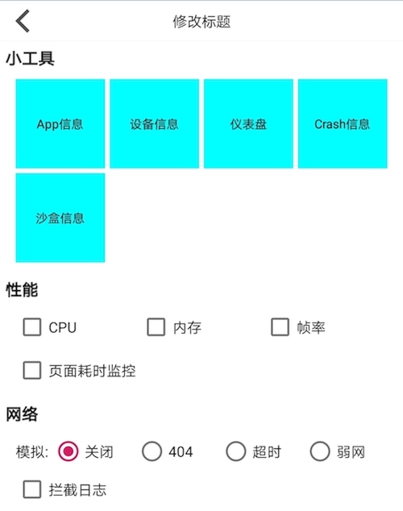
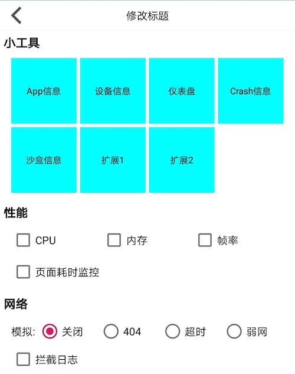
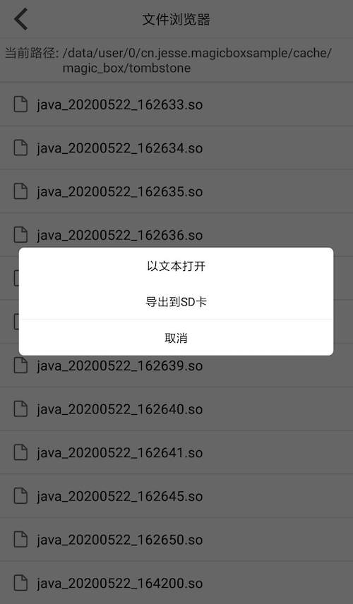

# Magic-Box

MagicBox是一款Android平台的小工具合集, 性能检测, 接口请求控制和拦截等功能集合. 建议在Debug和测试阶段使用.

## 功能清单

* 小工具: 提供各种小工具辅助开发测试, 并支持外部扩展.

    |功能|描述|
    |:-:|:-:|
    |APP信息|打开展示APP详细信息, 支持外部扩展|
    |设备信息|打开展示设备详细信息|
    |仪表盘|打开或关闭系统弹窗, 用于实时展示性能和网络数据|
    |Crash信息|直接在APP内查看Crash信息, 也支持导出到SD卡|
    |沙盒查看|查看APP沙盒空间, 支持文本预览和导出到SD卡|
    |...|支持外部动态扩展|

* 性能监控: 提供开关性能相关数据的监控, 实时性能数据可以展示在仪表盘上或直接回调.

    |功能|描述|
    |:-:|:-:|
    |CPU|开关监控APP的实时CPU使用率|
    |内存|开关监控APP的实时内存使用量|
    |帧率|开关监控APP的实时渲染帧率|
    |页面耗时|开关监控Activity和Fragment关键方法的耗时|

* 网络辅助(支持3.x okhttp): 支持开关模拟各种网络情况和拦截请求日志.

    |功能|描述|
    |:-:|:-:|
    |弱网模拟|接口请求的速度默认限制在1kb/s, 可以外部配置|
    |超时模拟|接口请求默认等待5s后, 返回400. 超时时间可配置|
    |404模拟|接口直接返回404|
    |拦截日志|拦截请求, 汇总基本属性和耗时等信息|

* TODO

    |TODO|描述|
    |:-:|:-:|
    |组件加载耗时监控|插桩监控页面, 服务等组件的加载耗时|
    |...|...|

### 额外开销

|额外开销|描述|
|:-:|:-:|
|线程1个|开启性能监控后, 启动线程处理数据|
|线程1个|预览沙盒文件时IO文件|
|网络拦截器2个|开启网络功能后, 用来模拟和拦截接口请求|
|系统弹窗权限|需要申请系统弹窗权限, 来进行数据可视化|
|存储权限|导出沙盒或Crash文件到SD卡时申请|
|包体积|增大100k左右|

## Gradle接入

根项目`build.gradle`中引入mavenCentral. 可选引入android-aop依赖, 用来插桩监控页面耗时.

```
buildscript {
    repositories {
        ...
        mavenCentral()
    }

    dependencies {
        ...
        // 可选依赖, 利用AspectJ在编译时插桩实现页面耗时监控
        classpath 'com.github.hijesse:android-aop:1.9.0'
    }
}
```

Module`build.gradle`中接入Magic-Box. 可选插入android-aop依赖插件, 引入插件后该module内的页面在编译期会被AOP插桩, 用来监控页面耗时.

```
// 可选插件, 同上
apply plugin: 'cn.jesse.aop.android-aop'

dependencies {
    compile 'com.github.hijesse:magic-box:1.1.1'
}
```

## 如何使用

* 初始化

    1. 初始化Magic-Box. 建议在Application中初始化MagicBox. SDK的初始化并没有做任何耗时操作, 只是全局缓存一下应用的context并标记是否要打印内部log.

        ```
        MagicBox.init(getApplication(), true);
        ```

    2. 初始化网络拦截器

        SDK提供两种方式添加拦截器并开启网络相关总开关: 

        使用SDK传入OKHttpClient自动添加拦截器并打开总开关.
        ```
        // 分别添加网络模拟拦截器和请求日志拦截器
        okHttpClient = MagicBox.getNetworkInfoManager().setSimulationEnable(true, okHttpClient);
        okHttpClient = MagicBox.getNetworkInfoManager().setRequestLoggerEnable(true, okHttpClient);
        ```

        或者使用OKHttp的builder手动添加网络拦截器.

        ```
        // 分别添加网络模拟和请求日志拦截器
        builder.addNetworkInterceptor(new SimulateNetworkInterceptor())
        builder.addInterceptor(new RequestLoggerInterceptor())
        ```

    3. 扩展APP信息展示

        ```
        List<MagicBoxDeviceAppInfoData> appData = new ArrayList<>();
        appData.add(new MagicBoxDeviceAppInfoData("渠道", "demo"));
        // 设置app信息的扩展数据
        MagicBox.setAppInfoExternalData(appData);
        ```

* 启动魔盒主页

    1. 启动默认魔盒主页

        

        ```
        /**
        * 启动默认魔盒主页
        *
        * @param context context
        * @param title   标题
        */
        MagicBoxActivity.start(context, title)
        ```

    2. 启动支持扩展小工具的魔盒主页, 并回调扩欧战小工具的点击事件.

        

        ```
        /**
        * 启动魔盒主页, 支持小工具扩展, 并监听回调
        * <p>
        * 回调以{@link #BASE_RESULT_CODE} 为基数
        * 加上tools数组下标为result code, 进行回调
        *
        * @param context     context
        * @param title       标题
        * @param requestCode 请求code
        * @param tools       扩展小工具
        */
        MagicBoxActivity.startActivityWithResult(activity, title,
                    REQUEST_MAGIC_BOX, new String[]{"扩展1", "扩展2"});
        ```

        以扩展的方式启动魔盒主页后, 在启动父级页面的`onActivityResult`里处理扩展的点击回调.

        

        ```
        if (requestCode != REQUEST_MAGIC_BOX) {
            return;
        }

        // 以BASE_RESULT_CODE 基数 + 扩展下标
        if (resultCode == MagicBoxActivity.BASE_RESULT_CODE) {
            toast("扩展1");
        } else if (resultCode == MagicBoxActivity.BASE_RESULT_CODE + 1) {
            toast("扩展2");
        }
        ```

* 独立开关

    1. 开关性能监控, 并监听性能数据回调. 将在仪表盘上展示的数据直接回调本地.

        

        ```
        // 开启性能监控
        MagicBox.getPerformanceManager().startMonitorCPU();
        MagicBox.getPerformanceManager().startMonitorMem();
        MagicBox.getPerformanceManager().startMonitorFPS();
        // 页面耗时监控需要配合android-aop插件引入
        AopManager.getInstance().setAopEnable(true);
        ```

        ```
        // 关闭性能监控
        MagicBox.getPerformanceManager().stopMonitorCPU();
        MagicBox.getPerformanceManager().stopMonitorMem();
        MagicBox.getPerformanceManager().stopMonitorFPS();
        AopManager.getInstance().setAopEnable(false);
        ```

        ```
        // 注册性能数据回调
        MagicBox.registerDashboardData(listener);
        // 非使用场景一定要注销, 避免内存泄露
        MagicBox.unregisterDashboardData(listener);

        /**
        * Magic Box所有数据监听. UI 线程回调.
        */
        public interface OnDashboardDataListener {
            /**
            * 性能相关数据回调
            *
            * @param performanceData 性能
            */
            void onPerformance(PerformanceData performanceData);

            /**
            * 网络请求拦截日志回调
            *
            * @param loggerData 拦截日志
            */
            void onHttpRequestLog(RequestLoggerData loggerData);

            /**
            * 页面渲染等耗时回调
            *
            * @param costing 耗时信息
            */
            void onPageRenderCosting(AopTimeCosting costing);
        }
        ```

    2. 开启Crash拦截, 建议在Application中初始化MagicBox后进行设置.

        ```
        // java crash拦截
        MagicBox.getJavaUncaughtCrashManager().enable(getApplication());
        ```

        开启Crash拦截, 在APP中发生Crash后SDK会将Crash信息保存至沙盒缓存文件中. 可以使用小工具直接文本查看或导出到SD卡.

         
        
        

    3. 开关网络模拟

        ```
        // 开启网络模拟总开关
        MagicBox.getNetworkInfoManager().setSimulationEnable(true)

        // 设置模拟网络超时, 并设置超时时间为10s
        MagicBox.getNetworkInfoManager().setSimulationType(NetworkInfoManager.SIMULATION_TYPE_TIMEOUT);
        MagicBox.getNetworkInfoManager().setSimulationTimeout(10000);

        // 模拟404
        MagicBox.getNetworkInfoManager().setSimulationType(NetworkInfoManager.SIMULATION_TYPE_BLOCK);

        // 设置模拟限速, 并设置限速为10k/s
        MagicBox.getNetworkInfoManager().setSimulationType(NetworkInfoManager.SIMULATION_TYPE_SPEED_LIMIT);
        MagicBox.getNetworkInfoManager().setSimulationRequestSpeed(10);
        ```

    4. 开关网络拦截

        ```
        // 开启网络拦截总开关
        MagicBox.getNetworkInfoManager().setRequestLoggerEnable(true);
        
        // 设置网络拦截域名白名单
        MagicBox.getNetworkInfoManager().setRequestLoggerHostWhiteList(new String[]{"www.github.com"});
        ```

